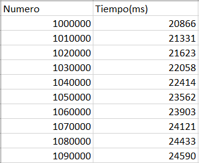
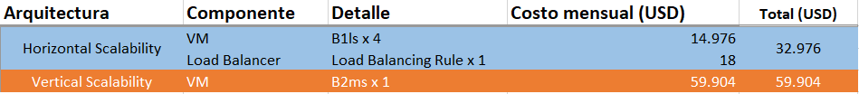
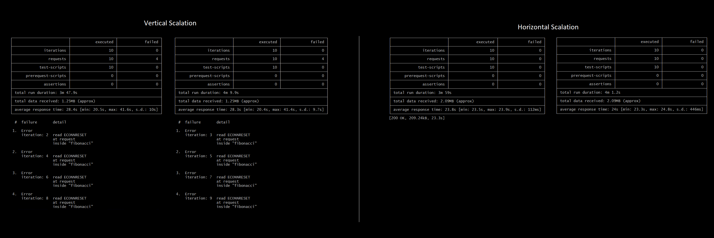
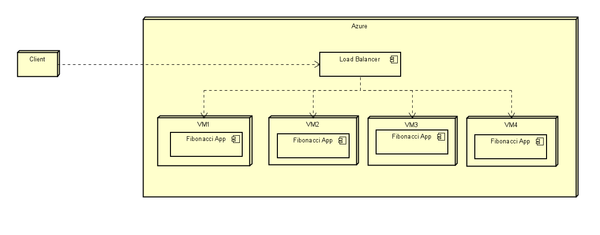

### Escuela Colombiana de Ingeniería
### Arquitecturas de Software - ARSW

## Escalamiento en Azure con Maquinas Virtuales, Sacale Sets y Service Plans

## Repositorio
 * [Github](https://github.com/J-382/ARSW_LAB-08/)

### Dependencias
* Cree una cuenta gratuita dentro de Azure. Para hacerlo puede guiarse de esta [documentación](https://azure.microsoft.com/en-us/free/search/?&ef_id=Cj0KCQiA2ITuBRDkARIsAMK9Q7MuvuTqIfK15LWfaM7bLL_QsBbC5XhJJezUbcfx-qAnfPjH568chTMaAkAsEALw_wcB:G:s&OCID=AID2000068_SEM_alOkB9ZE&MarinID=alOkB9ZE_368060503322_%2Bazure_b_c__79187603991_kwd-23159435208&lnkd=Google_Azure_Brand&dclid=CjgKEAiA2ITuBRDchty8lqPlzS4SJAC3x4k1mAxU7XNhWdOSESfffUnMNjLWcAIuikQnj3C4U8xRG_D_BwE). Al hacerlo usted contará con $200 USD para gastar durante 1 mes.

### Parte 0 - Entendiendo el escenario de calidad

Adjunto a este laboratorio usted podrá encontrar una aplicación totalmente desarrollada que tiene como objetivo calcular el enésimo valor de la secuencia de Fibonnaci.

**Escalabilidad**
Cuando un conjunto de usuarios consulta un enésimo número (superior a 1000000) de la secuencia de Fibonacci de forma concurrente y el sistema se encuentra bajo condiciones normales de operación, todas las peticiones deben ser respondidas y el consumo de CPU del sistema no puede superar el 70%.

### Parte 1 - Escalabilidad vertical

1. Diríjase a el [Portal de Azure](https://portal.azure.com/) y a continuación cree una maquina virtual con las características básicas descritas en la imágen 1 y que corresponden a las siguientes:
    * Resource Group = SCALABILITY_LAB
    * Virtual machine name = VERTICAL-SCALABILITY
    * Image = Ubuntu Server 
    * Size = Standard B1ls
    * Username = scalability_lab
    * SSH publi key = Su llave ssh publica


2. Para conectarse a la VM use el siguiente comando, donde las `x` las debe remplazar por la IP de su propia VM.

    `ssh scalability_lab@xxx.xxx.xxx.xxx`

3. Instale node, para ello siga la sección *Installing Node.js and npm using NVM* que encontrará en este [enlace](https://linuxize.com/post/how-to-install-node-js-on-ubuntu-18.04/).
4. Para instalar la aplicación adjunta al Laboratorio, suba la carpeta `FibonacciApp` a un repositorio al cual tenga acceso y ejecute estos comandos dentro de la VM:

    `git clone <your_repo>`

    `cd <your_repo>/FibonacciApp`

    `npm install`

5. Para ejecutar la aplicación puede usar el comando `npm FibinacciApp.js`, sin embargo una vez pierda la conexión ssh la aplicación dejará de funcionar. Para evitar ese compartamiento usaremos *forever*. Ejecute los siguientes comando dentro de la VM.

    `npm install forever -g`

    `forever start FibinacciApp.js`

6. Antes de verificar si el endpoint funciona, en Azure vaya a la sección de *Networking* y cree una *Inbound port rule* tal como se muestra en la imágen. Para verificar que la aplicación funciona, use un browser y user el endpoint `http://xxx.xxx.xxx.xxx:3000/fibonacci/6`. La respuesta debe ser `The answer is 8`.


7. La función que calcula en enésimo número de la secuencia de Fibonacci está muy mal construido y consume bastante CPU para obtener la respuesta. Usando la consola del Browser documente los tiempos de respuesta para dicho endpoint usando los siguintes valores:
    * 1000000
    * 1010000
    * 1020000
    * 1030000
    * 1040000
    * 1050000
    * 1060000
    * 1070000
    * 1080000
    * 1090000    

8. Dírijase ahora a Azure y verifique el consumo de CPU para la VM. (Los resultados pueden tardar 5 minutos en aparecer).


9. Ahora usaremos Postman para simular una carga concurrente a nuestro sistema. Siga estos pasos.
    * Instale newman con el comando `npm install newman -g`. Para conocer más de Newman consulte el siguiente [enlace](https://learning.getpostman.com/docs/postman/collection-runs/command-line-integration-with-newman/).
    * Diríjase hasta la ruta `FibonacciApp/postman` en una maquina diferente a la VM.
    * Para el archivo `[ARSW_LOAD-BALANCING_AZURE].postman_environment.json` cambie el valor del parámetro `VM1` para que coincida con la IP de su VM.
    * Ejecute el siguiente comando.

    ```
    newman run ARSW_LOAD-BALANCING_AZURE.postman_collection.json -e [ARSW_LOAD-BALANCING_AZURE].postman_environment.json -n 10 &
    newman run ARSW_LOAD-BALANCING_AZURE.postman_collection.json -e [ARSW_LOAD-BALANCING_AZURE].postman_environment.json -n 10
    ```

10. La cantidad de CPU consumida es bastante grande y un conjunto considerable de peticiones concurrentes pueden hacer fallar nuestro servicio. Para solucionarlo usaremos una estrategia de Escalamiento Vertical. En Azure diríjase a la sección *size* y a continuación seleccione el tamaño `B2ms`.


11. Una vez el cambio se vea reflejado, repita el paso 7, 8 y 9.
12. Evalue el escenario de calidad asociado al requerimiento no funcional de escalabilidad y concluya si usando este modelo de escalabilidad logramos cumplirlo.
13. Vuelva a dejar la VM en el tamaño inicial para evitar cobros adicionales.

**Preguntas**

1. ¿Cuántos y cuáles recursos crea Azure junto con la VM? 
   ```
   Crea 5 recursos además de la maquina virtual:
	• Red Virtual
	• Direccion IP Publica
    • Grupo de Seguridad (Red)
	• Interfaz de Red
	• Disco
   ```
2. ¿Brevemente describa para qué sirve cada recurso?
   ```• Red Virtual: La red virtual de azure permite muchos tipos de recursos de Azure, como Azure Virtual Machines (máquinas virtuales), para comunicarse de forma segura entre usuarios, con Internet y con las redes locales. VNet es similar a una red tradicional que funcionaría en su propio centro de datos, pero aporta las ventajas adicionales de la infraestructura de Azure, como la escala, la disponibilidad y el aislamiento.
   • Direccion IP Publica: Las direcciones IP públicas permiten a los recursos de Internet la comunicación entrante a los recursos de Azure. Azure asigna dinámicamente una dirección IP disponible que no está dedicada al recurso.
   • Grupo de seguridad: Un grupo de seguridad de red es un filtro aplicable al trafico que se genera desde y hacia los recursos de azure en una red virtual. Un grupo de seguridad de red contiene reglas de seguridad que permiten o deniegan el tráfico de red entrante o el tráfico de red saliente de varios tipos de recursos de Azure.
   • Interfaz de Red: Una interfaz de red permite que una máquina virtual de Azure se comunique con los recursos de Internet, Azure y locales.
   • Disco: Los discos de Azure son volúmenes de almacenamiento de nivel de bloque administrados por Azure y utilizados con las Maquinas Virtuales. Los discos administrados son como un disco físico en un servidor local, pero virtualizados.```
3. ¿Al cerrar la conexión ssh con la VM, por qué se cae la aplicación que ejecutamos con el comando `npm FibonacciApp.js`? ¿Por qué debemos crear un *Inbound port rule* antes de acceder al servicio?
   ```
   • Al cerrar la conexion SSH se cierra tambien la sesion de usuario en la Maquina virtual, terminando todos los procesos asociados a esta. 
   • Porque todas las peticiones que intenten acceder a un puerto que no esta abierto seran rechazadas automaticamente.
   ```
4. Adjunte tabla de tiempos e interprete por qué la función tarda tando tiempo.
   ```Los numeros que genera la funcion de Fibonacci crecen de manera alarmante a medida que la funcion se mueve en el eje x hacia el infinito, la aplicacion tiene que manejar la suma de enteros extremadamente grandes por varias iteraciones, dichas sumas son realizadas por el procesador, por lo que procesadores la potencia del procesador tendra un impacto enorme en el performance de la aplicacion.```
   
5. Adjunte imágen del consumo de CPU de la VM e interprete por qué la función consume esa cantidad de CPU.
   ```La CPU es la que se encarga de las operaciones matematicas, es de esperarse que el uso del CPU aumente considerablemente al tratarse de operaciones con numeros tan grandes.```
    

6. Adjunte la imagen del resumen de la ejecución de Postman. Interprete:
    * Tiempos de ejecución de cada petición.
    * Si hubo fallos documentelos y explique.
    
    
    ```
    • ECONNRESET: Finalización abrupta de la conexión TCP, probablemente debido a que el servidor estaba sobrecargado y era incapaz de responder
    ```

7. ¿Cuál es la diferencia entre los tamaños `B2ms` y `B1ls` (no solo busque especificaciones de infraestructura)?
    ```La B1ls es actualmente la oferta mas barata de Azure para maquinas virtuales, esta pensada para bases de datos pequeñas y entornos de pruebas, cuenta con 1 solo nucleo de procesamiento y 512MB de ram, las operaciones IO que soporta por segundo apenas llegan a las 160. La B2ms es un poco mas flexible con la carga que puede recibir, cuenta con 2 nucleos de procesamiento, 8GiB de memoria ram (16 veces mas que la B1ls) y las operaciones IO que soporta por segundo llegan a las 1920.```
8. ¿Aumentar el tamaño de la VM es una buena solución en este escenario?, ¿Qué pasa con la FibonacciApp cuando cambiamos el tamaño de la VM?
    ```Si bien los tiempos de respuesta de la aplicacion disminuyeron considerablemente, un escalamiento vertical no es una buena solucion para nuestro problema. Para las cargas concurrentes se siguen presentando perdidas de conexion con el servidor (Probablemente porque el servidor estaba ocupado resolviendo otra peticion y el timeout se completó).```
9.  ¿Qué pasa con la infraestructura cuando cambia el tamaño de la VM? ¿Qué efectos negativos implica?
    ```Los recursos siguen siendo los mismo. El unico efecto negativo evidente es que el costo de la arquitectura aumentará.```
10. ¿Hubo mejora en el consumo de CPU o en los tiempos de respuesta? Si/No ¿Por qué?
    ```No. Si bien hubo una mejora en los tiempos de respuesta, el consumo "disminuyó" porque la capacidad del nuevo procesador es mayor, pero al no hacer un cambio en el codigo la cantidad de procesador que requiere la App sigue siendo la misma.```
11. Aumente la cantidad de ejecuciones paralelas del comando de postman a `4`. ¿El comportamiento del sistema es porcentualmente mejor?
    ```No. Los tiempos de respuesta siguen siendo altos y no varian mucho con respecto a la prueba anterior, ademas de que se siguen presentando finalizaciones abruptas en la conexión por falta de respuesta de la maquina.```


### Parte 2 - Escalabilidad horizontal

#### Crear el Balanceador de Carga

Antes de continuar puede eliminar el grupo de recursos anterior para evitar gastos adicionales y realizar la actividad en un grupo de recursos totalmente limpio.

1. El Balanceador de Carga es un recurso fundamental para habilitar la escalabilidad horizontal de nuestro sistema, por eso en este paso cree un balanceador de carga dentro de Azure tal cual como se muestra en la imágen adjunta.


2. A continuación cree un *Backend Pool*, guiese con la siguiente imágen.


3. A continuación cree un *Health Probe*, guiese con la siguiente imágen.


4. A continuación cree un *Load Balancing Rule*, guiese con la siguiente imágen.


5. Cree una *Virtual Network* dentro del grupo de recursos, guiese con la siguiente imágen.


#### Crear las maquinas virtuales (Nodos)

Ahora vamos a crear 3 VMs (VM1, VM2 y VM3) con direcciones IP públicas standar en 3 diferentes zonas de disponibilidad. Después las agregaremos al balanceador de carga.

1. En la configuración básica de la VM guíese por la siguiente imágen. Es importante que se fije en la "Avaiability Zone", donde la VM1 será 1, la VM2 será 2 y la VM3 será 3.


2. En la configuración de networking, verifique que se ha seleccionado la *Virtual Network*  y la *Subnet* creadas anteriormente. Adicionalmente asigne una IP pública y no olvide habilitar la redundancia de zona.


3. Para el Network Security Group seleccione "avanzado" y realice la siguiente configuración. No olvide crear un *Inbound Rule*, en el cual habilite el tráfico por el puerto 3000. Cuando cree la VM2 y la VM3, no necesita volver a crear el *Network Security Group*, sino que puede seleccionar el anteriormente creado.


4. Ahora asignaremos esta VM a nuestro balanceador de carga, para ello siga la configuración de la siguiente imágen.


5. Finalmente debemos instalar la aplicación de Fibonacci en la VM. para ello puede ejecutar el conjunto de los siguientes comandos, cambiando el nombre de la VM por el correcto

```
git clone https://github.com/daprieto1/ARSW_LOAD-BALANCING_AZURE.git

curl -o- https://raw.githubusercontent.com/creationix/nvm/v0.34.0/install.sh | bash
source /home/vm1/.bashrc
nvm install node

cd ARSW_LOAD-BALANCING_AZURE/FibonacciApp
npm install

npm install forever -g
forever start FibonacciApp.js
```

Realice este proceso para las 3 VMs, por ahora lo haremos a mano una por una, sin embargo es importante que usted sepa que existen herramientas para aumatizar este proceso, entre ellas encontramos Azure Resource Manager, OsDisk Images, Terraform con Vagrant y Paker, Puppet, Ansible entre otras.

#### Probar el resultado final de nuestra infraestructura

1. Porsupuesto el endpoint de acceso a nuestro sistema será la IP pública del balanceador de carga, primero verifiquemos que los servicios básicos están funcionando, consuma los siguientes recursos:

```
http://52.155.223.248/
http://52.155.223.248/fibonacci/1
```

2. Realice las pruebas de carga con `newman` que se realizaron en la parte 1 y haga un informe comparativo donde contraste: tiempos de respuesta, cantidad de peticiones respondidas con éxito, costos de las 2 infraestrucruras, es decir, la que desarrollamos con balanceo de carga horizontal y la que se hizo con una maquina virtual escalada.

3. Agregue una 4 maquina virtual y realice las pruebas de newman, pero esta vez no lance 2 peticiones en paralelo, sino que incrementelo a 4. Haga un informe donde presente el comportamiento de la CPU de las 4 VM y explique porque la tasa de éxito de las peticiones aumento con este estilo de escalabilidad.


```Podemos observar que la carga al CPU es practicamente la misma para cada una de las maquinas virtuales, un buen indicio de que el balanceador de cargas funciona de manera correcta.```

```
newman run ARSW_LOAD-BALANCING_AZURE.postman_collection.json -e [ARSW_LOAD-BALANCING_AZURE].postman_environment.json -n 10 &
newman run ARSW_LOAD-BALANCING_AZURE.postman_collection.json -e [ARSW_LOAD-BALANCING_AZURE].postman_environment.json -n 10 &
newman run ARSW_LOAD-BALANCING_AZURE.postman_collection.json -e [ARSW_LOAD-BALANCING_AZURE].postman_environment.json -n 10 &
newman run ARSW_LOAD-BALANCING_AZURE.postman_collection.json -e [ARSW_LOAD-BALANCING_AZURE].postman_environment.json -n 10
```

**Preguntas**

* ¿Cuáles son los tipos de balanceadores de carga en Azure y en qué se diferencian?, ¿Qué es SKU, qué tipos hay y en qué se diferencian?, ¿Por qué el balanceador de carga necesita una IP pública?
    ```
    • Existen los balanceadores de carga publicos y los balanceadores de carga internos. Los balanceadores de carga publicos se encargan de regular la carga de peticiones provenientes del trafico de internet a las maquinas virtuales, es por esto que requieren una IP publica. Los privados realizan el mismo funcionamiento pero dentro de una red privada virtual.
    • Los SKU son los niveles de servicio en Azure. Determinan las caracteristicas de escalabilidad y operabilidad de un servicio y asi mismo su costo. Para la mayoria de servicios se encuentran los SKU: Basic, Standard, Premium.
    • Dado que el funcionamiento del balanceador de cargas es regular la carga del trafico del internet, es necesario exponerlo (IP publico) para que pueda recibir peticiones.
    ```
* ¿Cuál es el propósito del *Backend Pool*?
    ```
    • Es un grupo logico de instacias de una aplicacion, desplegadas a traves de diferentes regiones (o en la misma) y que reciben el mismo trafico y responden de la misma manera esperada.
    ```
* ¿Cuál es el propósito del *Health Probe*?
    ```
    • Ayudan al balanceador de cargas a determinar, a traves de peticiones de prueba, cual de los endpoints en el backend pool recibira la siguiente carga de peticiones.
    ```
* ¿Cuál es el propósito de la *Load Balancing Rule*? ¿Qué tipos de sesión persistente existen, por qué esto es importante y cómo puede afectar la escalabilidad del sistema?.
    ```
    • Define como se distribuye el tráfico entrante a todas las instancias dentro del grupo de backend. Una Load Balancing Rule asigna una configuración IP de frontend y un puerto determinado a varios puertos y direcciones IP del backend. 
    • Permiten que las peticiones de una direccion especifica sean atendidas por una sola maquina, puede persistirse la direccion IP del cliente y la direccion IP del cliente más el protocolo.
    ```
* ¿Qué es una *Virtual Network*? ¿Qué es una *Subnet*? ¿Para qué sirven los *address space* y *address range*?
    ```
    • Es el bloque de creación fundamental de una red privada en Azure. VNet permite muchos tipos de recursos de Azure, como las máquinas virtuales, comunicarse de forma segura con usuarios, Internet y redes locales.
    • Son un rango de direcciones IP dentro de una red virtual, configurados para mejorar la organizacion y seguridad de la red y sus recursos.
    • Rango de la red que se dividira en sub-redes
    • Rango de direcciones disponibles para la asignacion al momento de configurar una red virtual.
    ```
* ¿Qué son las *Availability Zone* y por qué seleccionamos 3 diferentes zonas?. ¿Qué significa que una IP sea *zone-redundant*?
* ¿Cuál es el propósito del *Network Security Group*?
    ```
    • Su porposito es filtrar el trafico desde y hacia una serie de recursos en una red virtual. Un Network Security Group contiene reglas de seguridad que permiten aceptar o denegar el trafico de red entrante o saliente para varios tipos de recursos (VM, Load-Balancers, etc). En dichas reglas se puede especificar origen, destino, puerto y protocolo.
    ```
* Informe de newman 1 (Punto 2)


    `El escalamiento horizontal resulta ser mejor tanto economicamente como en performance, para la misma carga concurrente de peticiones(2), el escalamiento horizontal logro responder satisfactoriamente cada una de las peticiones ademas de mantener tiempos de respuesta bajos.`
* Presente el Diagrama de Despliegue de la solución.



